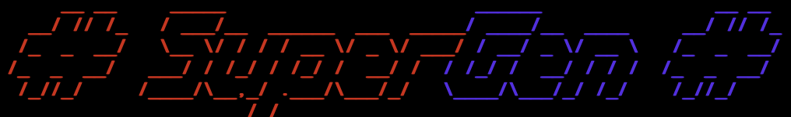

The glue between your old cartridges and modern emulators.

# Quick Start

* Clone the project
* Configure `config.yml` according to your system.
* From command line, run `./supergen.py`
* Plug an USB drive or mount a disk image containing a ROM 
  for any of the supported systems.
* Play the game.

# Configuration

## Emulators

Use `config.yml` file to configure the emulators you would like
to use for each supported platform.

## ROM cache and saves

Still in development.

# Supported Systems
* SNES

# Requirements
* MacOS or Linux.
* Python3.
* Libraries specified in `requirements.txt`. 
* Console of at least 15 lines.
* Installed emulators (should be configured through `config.yml`).
